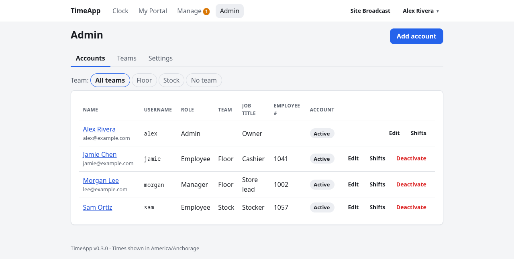
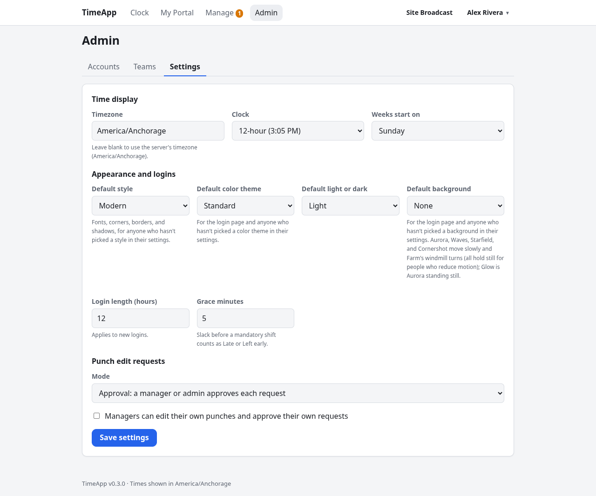

# Admin guide

**For:** admins.
Admins can do everything managers can, for **every** account, and also manage accounts and the app's settings. This guide covers only what's admin-only, so read the [Manager guide](MANAGER.md) too, and the [Employee guide](EMPLOYEE.md) for your own clock and portal. Setting up a new install? Start with the [Quickstart](QUICKSTART.md).

- [What only admins can do](#what-only-admins-can-do)
- [Accounts](#accounts)
  - [Add an account](#add-an-account)
  - [Edit an account](#edit-an-account)
  - [Change a role or deactivate someone](#change-a-role-or-deactivate-someone)
  - [Reset a password](#reset-a-password)
- [Settings](#settings)
- [Locked out?](#locked-out)

---

## What only admins can do
When you log in, you land on **Admin**. You also have **Clock**, **My Portal** and **Manage**, like everyone else.

Compared with a manager, an admin can:
- **See everyone in Manage**, including managers and yourself, and change their punches.
- **Approve or deny anyone's edit requests**, including a manager's.
- **Assign shifts and break allowances to managers**, and to yourself. Managers can never do this for themselves.
- **Delete anyone's shift notes.** Everyone else can only delete their own.
- **Add accounts**, edit them, change roles, deactivate people and reset passwords.
- **Change Admin → Settings.**

On a person's page in **Manage**, admins also get an **Edit account** button, and the **Manage** page has **Add account**.

---

## Accounts


**Admin** opens the **Accounts** tab: everyone, with their name and email, **Username**, **Role**, **Job title**, **Employee #**, and whether the account is **Active** or **Inactive**. The buttons on each row:
- **Edit**: opens the account.
- **Shifts**: opens their page in **Manage** (punches, schedule, requests, details).
- **Deactivate** / **Reactivate**: not shown on your own row.

Accounts can't be deleted. Deactivate people who leave, which keeps their history.

### Add an account
1. Click **Add account** (on **Admin**, or on **Manage**).
2. Fill in the form:
   - **Username**: 2–32 characters, using letters, numbers, dots, dashes or underscores. It must be unique. Logging in isn't case-sensitive.
   - **Display name**, **Email**, **Phone**, **Job title**: optional.
   - **Employee number**: optional, but no two people can share one.
   - **Role**: see the table below.
   - **Password**: at least 8 characters.
3. Click **Create account**. Give the person their username and password; they can change the password under **Settings** after logging in.

Which role to pick:

| Role | Can use |
|---|---|
| **Employee** | Clock and their own Portal. |
| **Manager** | Also the Manage pages, for employee accounts. |
| **Admin** | Everything, including accounts and settings. |

Everyone also has **Profile** and **Settings** in the menu under their name.

### Edit an account
Click a name, or **Edit**. The top of the page shows their username, when the account was created, their role, and a **Shifts** link. There are three tabs: **Profile**, **Access** and **Password**.

On **Profile** you can change the username, display name, email, phone, job title and employee number. People can change their own name, email and phone from their Profile page. The username, job title and employee number are only editable here.

### Change a role or deactivate someone
Use the **Access** tab.

- **Role:** pick one and click **Save role**. You can't change your own role; another admin has to.
- **Account status:**
  - **Deactivate account** stops the person from logging in and logs them out on every device immediately. Their punches, notes, requests and schedule stay. In **Manage** they're still listed, marked **Inactive**. If they try to log in, they see "Invalid username or password."
  - **Reactivate account** lets them log in again.
  - You can't deactivate your own account.

You can also deactivate or reactivate people straight from the **Accounts** list.

### Reset a password
Use the **Password** tab. Enter the **New password** twice and click **Set password**.
- **For someone else:** they're logged out everywhere, so let them know the new password.
- **For yourself:** your other devices are logged out and this one stays logged in.

---

## Settings


**Admin → Settings** controls app-wide options. Click **Save settings**; changes apply right away, with no restart. Anything you save here replaces the defaults in `config.js`.

### Time display
- **Timezone**: every time in the app is shown and entered in this timezone. Start typing for suggestions (e.g. `America/Chicago`). Leave it blank to use the server's timezone, which the empty box shows.
- **Clock**: 12-hour (3:05 PM) or 24-hour (15:05).
- **Weeks start on**: the first day of the week for **This week** / **Last week**, the weekly schedule, weekly timesheet exports, and the order of days in everyone's availability.

### Appearance and logins
- **Default style**, **Default color theme**, **Default light or dark**, **Default background**: the look for the login page, and for everyone who hasn't picked their own in **Settings**. People who have picked keep their choice. See the [Appearance guide](APPEARANCE.md).
- **Login length (hours)**: 1–720. How long someone stays logged in before logging in again. It applies to new logins.
- **Grace minutes**: 0–240. How much slack people get before an assigned shift counts as **Late** or **Left early**.

### Punch edit requests
- **Mode**:
  - **Disabled**: employees can't request changes. Managers fix punches directly.
  - **Approval**: requests wait until a manager or admin approves them, which applies the change.
  - **Honor system**: requests apply immediately and are logged as **Auto-approved**.
- **Managers can edit their own punches and approve their own requests**: off by default. When it's on, managers see themselves in **Manage** and can change their own punches and review their own requests. Assigning a manager's shifts or break allowance still takes an admin.

Break rules are set separately under [Manage → Break rules](MANAGER.md#set-break-rules).

---

## Locked out?
If no admin can log in, for example because the only admin forgot their password, create a new admin on the server:

```sh
npm run seed -- <new-username> [password]
```

Then log in with it and reset the other account's password on its **Password** tab. The seed command won't reuse a username that already exists. More in the [Quickstart](QUICKSTART.md#install-and-create-the-first-admin).
