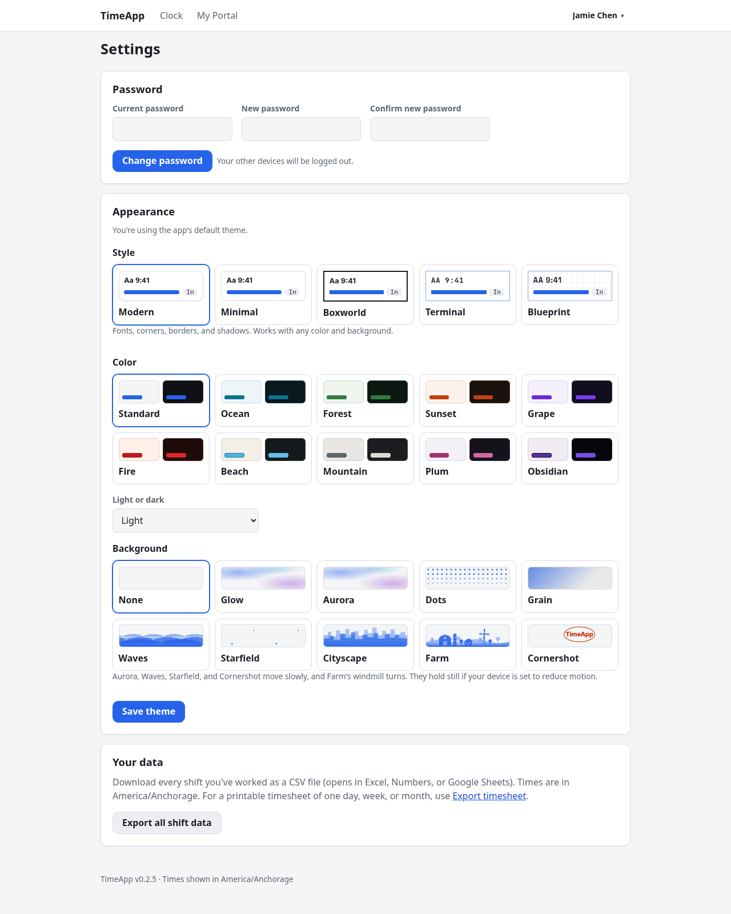
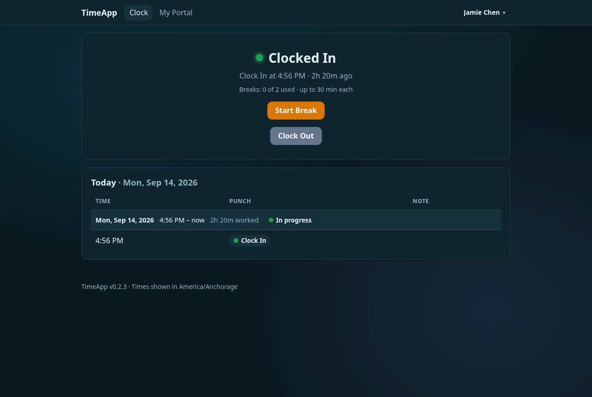
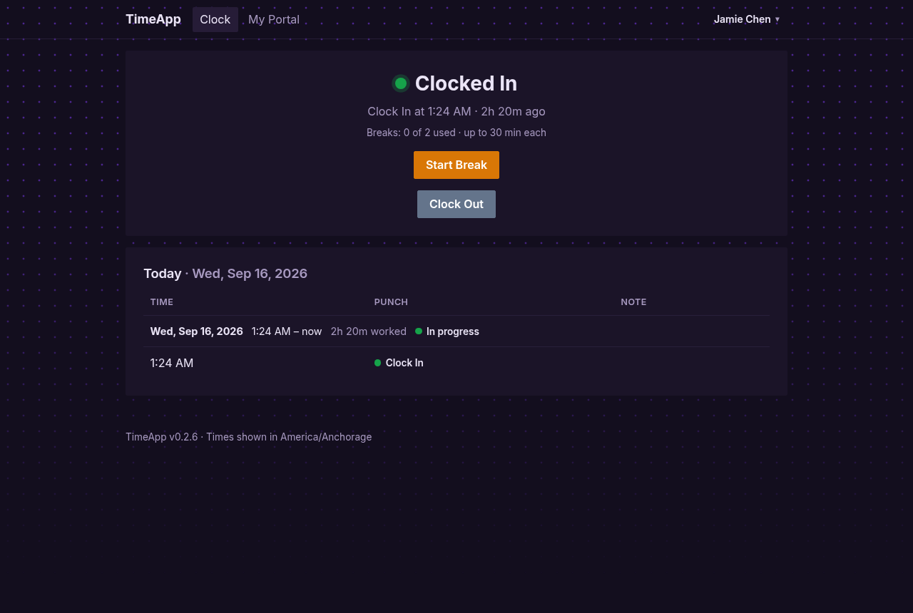
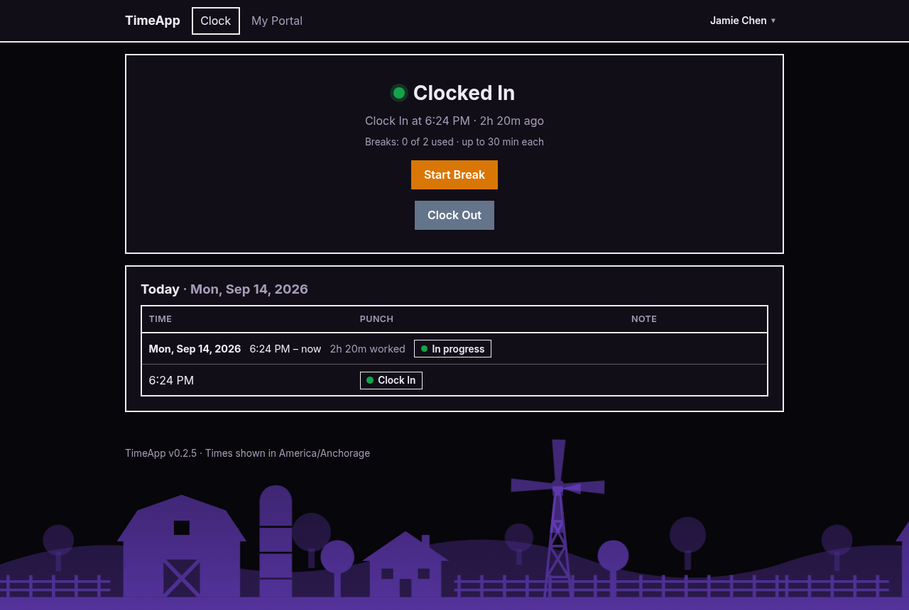
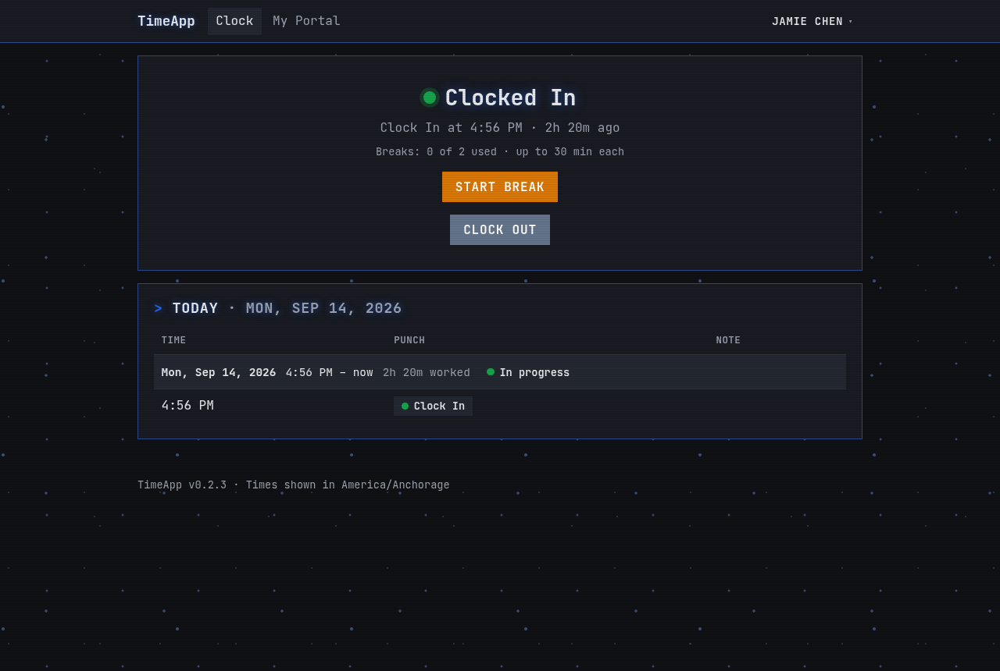
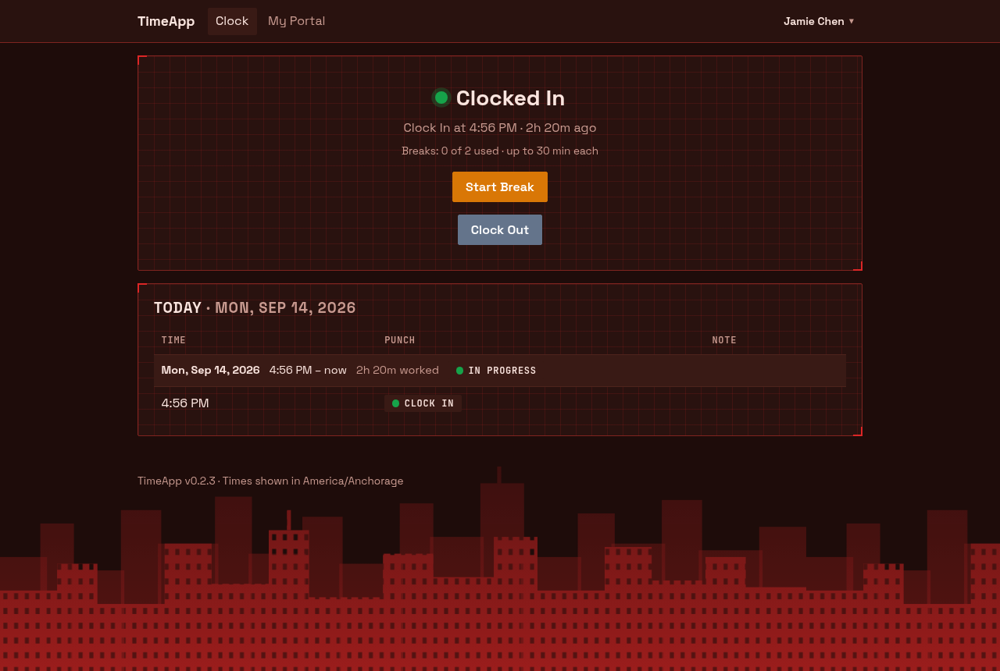

# Appearance guide

**For:** everyone who wants to change how TimeApp looks for them, and admins choosing the default look.
Related: [Employee](EMPLOYEE.md) · [Manager](MANAGER.md) · [Admin](ADMIN.md) · [Quickstart](QUICKSTART.md)

- [Change your look](#change-your-look)
- [Style](#style)
- [Color](#color)
- [Light or dark](#light-or-dark)
- [Background](#background)
- [Good to know](#good-to-know)
- [Defaults for everyone (admins)](#defaults-for-everyone-admins)
- [Tuning and adding looks (hosts)](#tuning-and-adding-looks-hosts)

---

## Change your look
1. Click your name in the top right, then **Settings**.
2. In **Appearance**, pick a **Style**, a **Color**, **Light or dark**, and a **Background**. Each option has a small preview.
3. Click **Save theme**.

Your choice is saved to your account, so it follows you to any device you log in on.

Until you save a choice, you get the app's default look, and the page says "You're using the app's default theme." To go back to the defaults later, click **Use the app default**.

---

## Style
A style changes fonts, corners, borders and shadows, but never colors, so every style works with every color.

| Style | Look |
|---|---|
| **Modern** | Rounded cards, soft shadows, your device's standard font. The default. |
| **Minimal** | Flat and quiet: the Inter font, no shadows, gentle corners, outlined buttons and badges. |
| **Boxworld** | Stripped down to boxes: square corners and bold outlines in the text color, with no shadows or tinted fills. Tabs and tables are boxed, and main buttons are solid. |
| **Terminal** | Monospace text and square boxes, uppercase headings with a `>` prompt and a blinking cursor, faint scanlines, and a soft glow in dark mode. |
| **Blueprint** | Like a technical drawing: the Space Grotesk font, uppercase monospace labels, a faint grid on cards with corner marks, and dashed input boxes. |

| Modern | Minimal |
|---|---|
|  |  |
| **Boxworld** | **Terminal** |
|  |  |
| **Blueprint** | |
|  | |

---

## Color
| Color | Look |
|---|---|
| **Standard** | Blue |
| **Ocean** | Blue and teal |
| **Forest** | Green |
| **Sunset** | Orange and coral |
| **Grape** | Purple |
| **Fire** | Red, with warm backgrounds |
| **Beach** | Light blue on cool sand |
| **Mountain** | Slate gray and soft white on off-tone gray |
| **Plum** | Reddish purple on cool, purplish backgrounds |
| **Obsidian** | Dark purple and black on crisp lavender, or purple on near-black in dark mode |

Each color has a light and a dark version; the two swatches show both.

## Light or dark
- **Match my device**: follows your phone or computer's light/dark setting, and switches when it does.
- **Light** or **Dark**: always that.

## Background
Backgrounds are drawn behind the page in your color. Cards stay solid, so text is just as readable.

| Background | Look | Moves? |
|---|---|---|
| **None** | Plain | |
| **Glow** | Soft, blurry blobs of color | |
| **Aurora** | The Glow blobs, slowly drifting | Yes |
| **Dots** | Dotted paper that fades out toward the bottom | |
| **Grain** | A wash of color with a film-grain texture | |
| **Waves** | Rows of rolling waves along the bottom | Yes |
| **Starfield** | Small specks that slowly shimmer and drift | Yes |
| **Cityscape** | A skyline along the bottom, with lit windows | |
| **Farm** | A farm along the bottom: barn, silo, farmhouse, fence, trees, and a windmill | The windmill turns |
| **Cornershot** | The app name bouncing around the screen like an old DVD logo, changing color each time it hits a wall, and never quite hitting a corner | Yes |

The moving backgrounds hold still if your device's **reduce motion** accessibility setting is on. Cornershot then waits just short of the bottom-right corner.

---

## Good to know
- **Any combination works.** Style, color, light/dark and background are all independent.
- **Timesheets are never themed.** Printed timesheets, saved PDFs and downloaded images are always plain black on white.
- **Looks unchanged or broken after the app was updated?** Your browser may still have the old styles. Do a hard reload: **Ctrl+Shift+R**, or **Cmd+Shift+R** on a Mac.

---

## Defaults for everyone (admins)
Under **Admin → Settings**, set **Default style**, **Default color theme**, **Default light or dark** and **Default background**. They apply to the login page and to everyone who hasn't saved a look of their own. People who have chosen keep their choice. See the [Admin guide](ADMIN.md#settings).

---

## Tuning and adding looks (hosts)
- **Starting defaults** are in `config.js`, under `ui_config` (`defaultStyle`, `defaultColor`, `defaultTheme`, `defaultBackground`). They're used until an admin saves **Admin → Settings**.
- **Fine-tuning** happens at the top of `public/timeapp.css`, in section 1:
  - `--bg-glow-strength`: how strongly every background is tinted with the theme color.
  - `--bg-glow-dark-boost`: how much stronger backgrounds are in dark mode.
  - `--aurora-duration`, `--waves-duration`, `--starfield-duration`, `--farm-blades-duration`: animation speeds. Bigger is slower.
- **Cornershot** is set up in `config.js` under `cornershot_config`, and needs a server restart:
  - `text`: the logo text; empty uses the app name.
  - `size`: width in pixels.
  - `xSeconds`, `ySeconds`: how long it takes to cross the screen each way (whole seconds).
  - `nearMissSeconds`: how far out of step the two directions run. Keep it off multiples of the largest number dividing both durations, so it can never hit a corner exactly; the server warns and corrects it if not.
  - `colorShift`: whether it changes color on each hit.
  - `opacity`: how visible it is.
- **Adding a color:** add a light and a dark palette block to section 2 of `public/timeapp.css`, then add the name to `THEME_COLORS` and `THEME_COLOR_LABELS` in `themes.js`. Set `--accent-contrast` to a color that reads on your accent (it's the text on main buttons). If the accent is too pale to see as a thin line, also set `--accent-line` to a darker shade in the light block, and reset it to `var(--accent)` in the dark block if dark mode doesn't need it.
- **Adding a style:** add a block overriding the style variables (and any component rules) to section 9 of `public/timeapp.css`, then add the name to `THEME_STYLES` and `THEME_STYLE_LABELS` in `themes.js`. If it needs a font, serve an `@fontsource` package from `server.js` and link it in `views/partials/head.ejs`.
- **Adding a background:** add a rule to the "Backgrounds" block of `public/timeapp.css`, then add the name to `THEME_BACKGROUNDS` and `THEME_BACKGROUND_LABELS` in `themes.js`.
  - **Layers:** it draws on `body::before`. If it needs a second layer, use `html::after` (like Farm's windmill blades); `body::after` belongs to the Terminal style.
  - **Preview:** give it a matching `.bg-swatch` rule. Size things in `--bg-u-w` / `--bg-u-h` units, which mean the screen on the page and the preview box in Settings, so one set of rules draws both.
  - **Motion:** animate only `transform`, `translate` or `opacity`, and add a reduce-motion rule.
- None of these need a database change. After updating the live site, remember the stylesheet cache note in the [Quickstart](QUICKSTART.md#behind-nginx-and-cloudflare).
