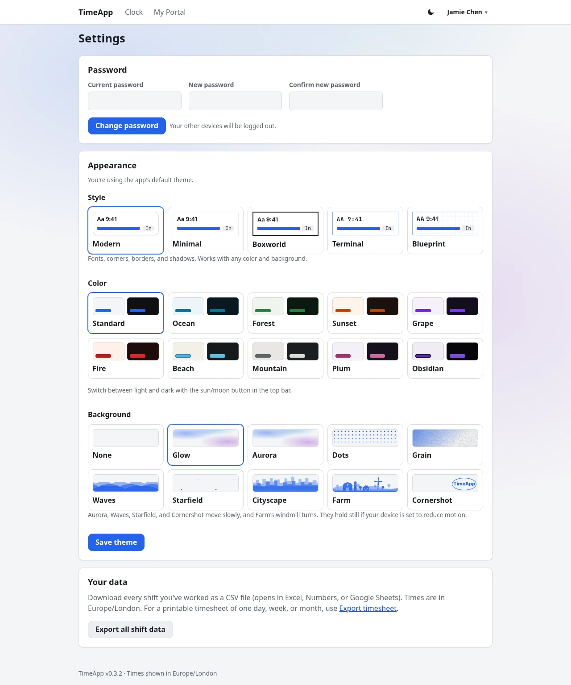

# Appearance guide

**For:** everyone who wants to change how TimeApp looks for them, and admins choosing the default look.
Related: [Employee](EMPLOYEE.md) · [Manager](MANAGER.md) · [Admin](ADMIN.md) · [Quickstart](QUICKSTART.md)
Every option pictured, light and dark side by side, and how it all works: the [Theme engine guide](theme_engine/THEME_ENGINE.md).

- [Change your look](#change-your-look)
- [Style](#style)
- [Color](#color)
- [Light or dark](#light-or-dark)
- [Background](#background)
- [Good to know](#good-to-know)
- [Defaults for everyone (admins)](#defaults-for-everyone-admins)
- [Tuning and adding looks (hosts)](#tuning-and-adding-looks-hosts)

---

## Change your look
1. Click your name in the top right, then **Settings**.
2. In **Appearance**, pick a **Style**, a **Color**, and a **Background**. Each option has a small preview.
3. Click **Save theme**.

For light or dark, use the sun/moon button in the top bar instead (see [Light or dark](#light-or-dark)). Both are saved to your account, so they follow you to any device you log in on.

Until you save a choice, you get the app's default look, and the page says "You're using the app's default theme." To go back to the defaults later, click **Use the app default**. That resets light or dark too.

---

## Style
A style changes fonts, corners, borders and shadows, but never colors, so every style works with every color.

| Style | Look |
|---|---|
| **Modern** | Rounded cards, soft shadows, your device's standard font. The default. |
| **Minimal** | Pared back: the Inter font, no shadows, cards and the top bar without outlines, hairline rules, plain badges, and outlined buttons. |
| **Boxworld** | Stripped down to boxes: square corners and bold outlines in the text color, with no shadows or tinted fills. Tabs and tables are boxed, and main buttons are solid. |
| **Terminal** | Monospace text and square boxes, uppercase headings with a `>` prompt and a blinking cursor, faint scanlines, and a soft glow in dark mode. |
| **Blueprint** | Like a technical drawing: the Space Grotesk font, uppercase monospace labels, a faint grid on cards with corner marks, and dashed input boxes. |

| Modern | Minimal |
|---|---|
|  |  |
| **Boxworld** | **Terminal** |
|  |  |
| **Blueprint** | |
|  | |

---

## Color
| Color | Look |
|---|---|
| **Standard** | Blue |
| **Ocean** | Blue and teal |
| **Forest** | Green |
| **Sunset** | Orange and coral |
| **Grape** | Purple |
| **Fire** | Red, with warm backgrounds |
| **Beach** | Light blue on cool sand |
| **Mountain** | Slate gray and soft white on off-tone gray |
| **Plum** | Reddish purple on cool, purplish backgrounds |
| **Obsidian** | Dark purple and black on crisp lavender, or purple on near-black in dark mode |

Each color has a light and a dark version; the two swatches show both. The [Theme engine guide](theme_engine/THEME_ENGINE.md#colors) pictures every one in both.

## Light or dark
| Light (click for dark) | Dark (click for light) |
|---|---|
|  |  |

Click the button in the top bar, left of your name, to switch. It shows a **moon** while the page is light and a **sun** while it's dark. The page switches at once, and your choice is saved to your account.

- **Until you first click it**, you get the app's default. That may be **Match my device**, which follows your phone or computer's light/dark setting and switches when it does.
- **On the login page** the button works too, if your admin allows it. It's remembered in that browser.
- **No button?** Your admin has turned it off, and everyone gets the default.

## Background
Backgrounds are drawn behind the page in your color. Cards stay solid, so text is just as readable.

| Background | Look | Moves? |
|---|---|---|
| **None** | Plain | |
| **Glow** | Soft, blurry blobs of color | |
| **Aurora** | The Glow blobs, slowly drifting | Yes |
| **Dots** | Dotted paper that fades out toward the bottom | |
| **Grain** | A wash of color with a film-grain texture | |
| **Waves** | Rows of rolling waves along the bottom | Yes |
| **Starfield** | Small specks that slowly shimmer and drift | Yes |
| **Cityscape** | A skyline along the bottom, with lit windows | |
| **Farm** | A farm along the bottom: barn, silo, farmhouse, fence, trees, and a windmill | The windmill turns |
| **Cornershot** | The app name bouncing around the screen like an old DVD logo, changing color each time it hits a wall, and never quite hitting a corner | Yes |

The moving backgrounds hold still if your device's **reduce motion** accessibility setting is on. Cornershot then waits just short of the bottom-right corner.

---

## Good to know
- **Any combination works.** Style, color, light/dark and background are all independent.
- **Timesheets are never themed.** Printed timesheets, saved PDFs and downloaded images are always plain black on white.
- **Looks unchanged or broken after the app was updated?** Your browser may still have the old styles. Do a hard reload: **Ctrl+Shift+R**, or **Cmd+Shift+R** on a Mac.

---

## Defaults for everyone (admins)
Under **Admin → Settings**, set **Default style**, **Default color theme**, **Default light or dark** and **Default background**. They apply to the login page and to everyone who hasn't saved a look of their own. People who have chosen keep their choice.

Two checkboxes control the light/dark button:
- **Show the light/dark button in the top bar**: turn it off, and everyone gets **Default light or dark**.
- **Let people switch light/dark on the login page too**: the choice is remembered in that browser with a cookie.

See the [Admin guide](ADMIN.md#settings).

---

## Tuning and adding looks (hosts)
- **Starting defaults** are in `config.js`, under `ui_config`: `defaultStyle`, `defaultColor`, `defaultTheme`, `defaultBackground`, and `showModeToggle` / `rememberGuestMode` for the light/dark button. They're used until an admin saves **Admin → Settings**.
- **Background strength and animation speeds** are at the top of `public/timeapp.css`, in section 1. **Cornershot** is set up in `config.js` under `cornershot_config`.
- **Adding a color, style or background** takes a CSS block and a name in `themes.js`, with no database change.

The [Theme engine guide](theme_engine/THEME_ENGINE.md) covers all of these step by step: [Tuning](theme_engine/THEME_ENGINE.md#tuning) and [Adding your own](theme_engine/THEME_ENGINE.md#adding-your-own).
