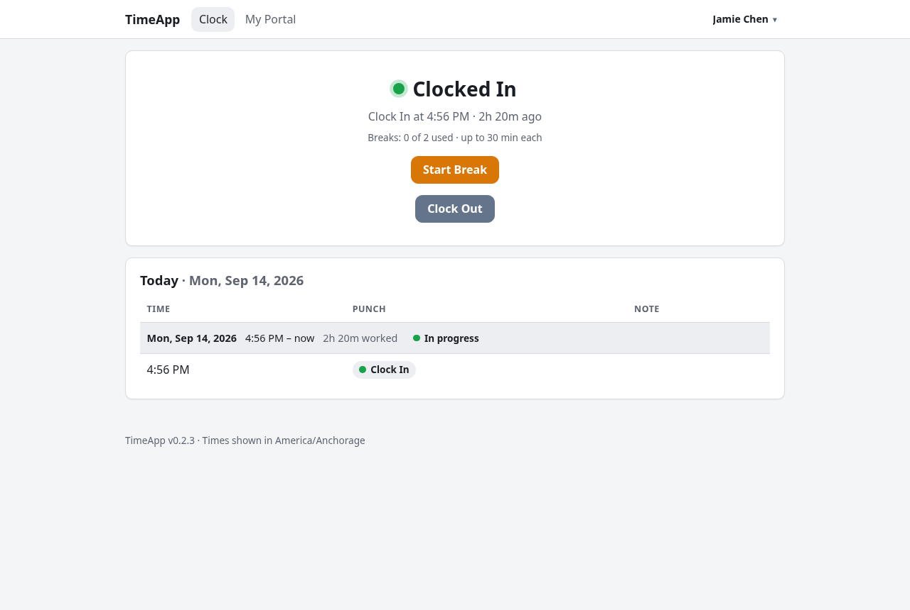
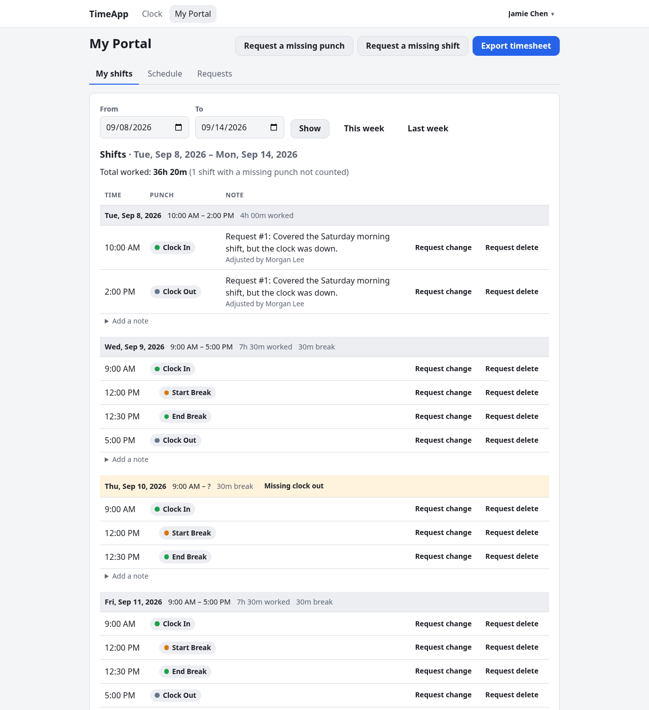
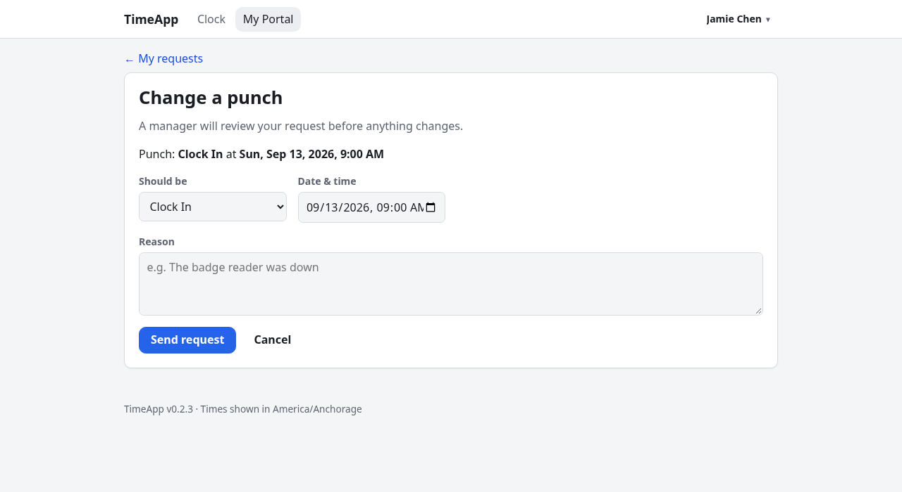
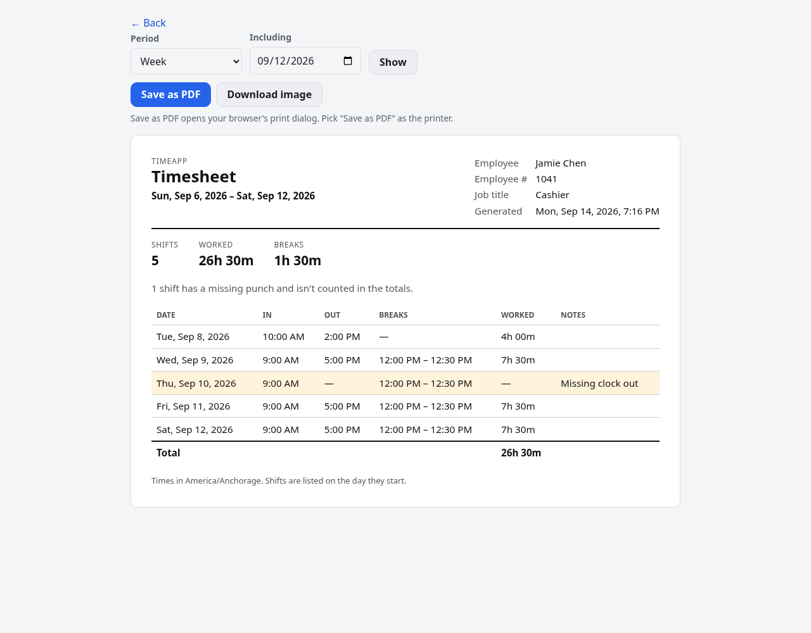
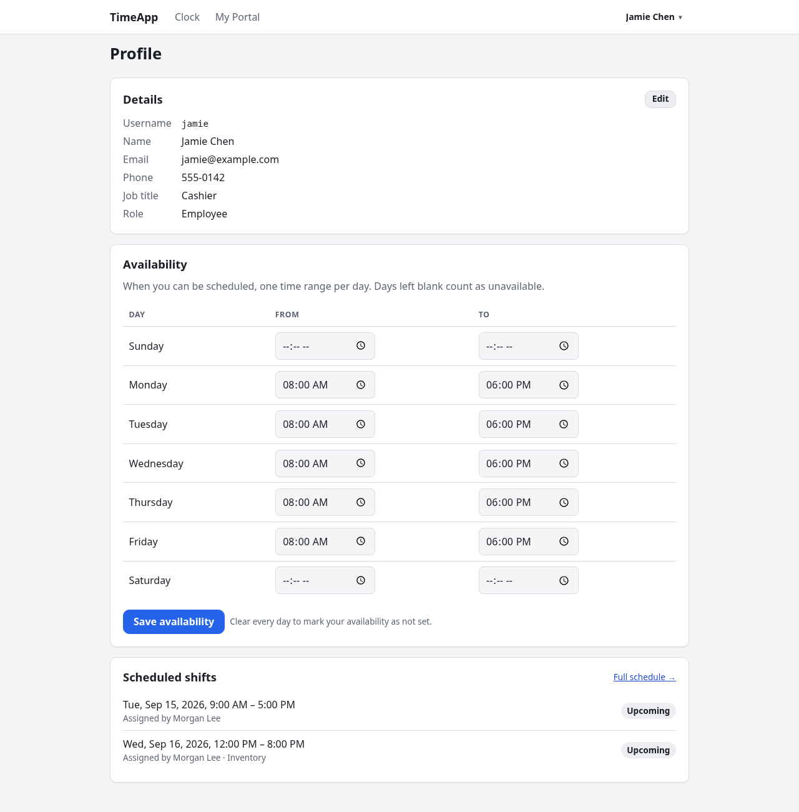

# Employee guide

**For:** everyone who clocks in with TimeApp.
Managers and admins use everything here too, for their own time. Related: [Manager](MANAGER.md) · [Admin](ADMIN.md) · [Appearance](APPEARANCE.md)

- [Log in and find your way around](#log-in-and-find-your-way-around)
- [Clock in, take breaks, clock out](#clock-in-take-breaks-clock-out)
- [Your Portal home](#your-portal-home)
- [See your shifts](#see-your-shifts)
- [Add notes to a shift](#add-notes-to-a-shift)
- [Fix a wrong or missing punch](#fix-a-wrong-or-missing-punch)
- [See your schedule](#see-your-schedule)
- [Export a timesheet](#export-a-timesheet)
- [Your profile and availability](#your-profile-and-availability)
- [Settings: password, appearance, and your data](#settings-password-appearance-and-your-data)
- [Troubleshooting](#troubleshooting)

---

## Log in and find your way around
Open the TimeApp address you were given, enter your **Username** and **Password**, and click **Log in**. Your username isn't case-sensitive. You land on the **Clock** page.

- **The top bar** has **Clock** and **My Portal**. Managers also see **Manage**, and admins **Admin**.
- **Your name** in the top right opens a menu with **Profile**, **Settings** and **Log out**.
- **All times** are shown in your workplace's timezone; the page footer says which one.

---

## Clock in, take breaks, clock out

The **Clock** page shows your status (**Clocked Out**, **Clocked In** or **On Break**), then:
- **Last clock**: your last **Clock In** or **Clock Out** and how long ago it was. On a break, it says "On break since …" and how long the break has lasted.
- **This shift** (while you're clocked in or on break): how long since you clocked in, how much of that you've **worked**, and your **break** time so far.
- **This week**: the hours you've worked since the start of the week, including the shift you're on. Shifts with a missing punch aren't counted, and the page says how many were left out (see [Fix a wrong or missing punch](#fix-a-wrong-or-missing-punch)).

These times keep counting while the page is open. Below them are the button(s) you can press next:

| When you're | You can press |
|---|---|
| **Clocked Out** | **Clock In** |
| **Clocked In** | **Start Break** or **Clock Out** |
| **On Break** | **End Break** |

Under the buttons, **Today** lists today's punches, grouped into shifts.

**Breaks.** If your workplace limits breaks, the page shows something like "Breaks: 1 of 2 used · up to 30 min each".
- **Start Break** disappears once you've used all your breaks for the shift.
- If a break runs long, you'll see "Your break has gone over 30 minutes." It isn't stopped, but it's flagged on the shift.

**Scheduled today.** If a manager assigned you a shift today, it shows as "Scheduled today: 9:00 AM – 5:00 PM".

**"The page was out of date."** If you punched from another tab, phone or computer, the page may be behind. You'll see a message like "Couldn't Clock In: you're currently Clocked In…" and the page refreshes with the right buttons. Nothing was recorded twice.

---

## Your Portal home
**My Portal** opens on **Home**, a summary of your time:

- **Hours worked**: time worked **Today**, **This week**, **This month** and **Year to date**. These use the same rules as your shifts and timesheets: a shift counts on the day it starts, and a shift with a missing punch isn't counted until it's fixed (the tile says how many were left out).
- **This week**: each day of the week with the mandatory shifts a manager assigned you, their times and hours, or **Off** if nothing is scheduled. Today's row is highlighted. **Full schedule →** opens **My Portal → Schedule**.
- **Worked vs scheduled**: the same four periods as "**4h 00m** of 6h 00m scheduled", with a bar. Scheduled hours are every assigned shift in the whole period, including ones still ahead, so the week's number is the full week's schedule. If nothing is scheduled, the tile says **nothing scheduled**.

---

## See your shifts

**My Portal → My shifts** shows this week's shifts.
- **Change the dates:** set **From** and **To** and click **Show**, or use **This week** / **Last week**.
- **Total worked:** the sum for shifts that start in the range, not counting breaks.
- **Each shift** shows its date, start and end times, time worked and break time. The punches are listed underneath; break punches are indented.

What the badges mean:
- **In progress**: you're still clocked in.
- **Missing clock out**, **Missing clock in**, **Break missing end**, **Break missing start**: a punch is missing. The shift is highlighted and **not counted** in totals until it's fixed (see [Fix a wrong or missing punch](#fix-a-wrong-or-missing-punch)).
- **Break over 30 min**, or **3 breaks (limit 2)**: the shift broke a break rule. It's still counted.

**Overnight shifts** show up whole on the day they started. **Adjusted by …** under a punch means someone other than you added or changed it.

---

## Add notes to a shift
Every shift in **My shifts** has a note thread. You and your managers can post.
1. Click **Add a note**, or **Notes (2)** if the shift already has some, under the shift.
2. Type your note (up to 1,000 characters) and click **Add note**.

You can **Delete** notes you wrote.

---

## Fix a wrong or missing punch
You can't edit punches yourself, but you can ask. Every request needs a **Reason**, up to 500 characters.

| To… | Do this |
|---|---|
| Fix a punch's type or time | In **My shifts**, click **Request change** next to the punch. Pick what it **Should be** and the right **Date & time**. |
| Remove a punch made by mistake | Click **Request delete** next to the punch. |
| Add a punch you forgot (e.g. a clock-out) | Click **Request a missing punch** at the top of **My Portal → My shifts**. Pick the **Punch** type and **Date & time**. |
| Add a whole shift that never got recorded | Click **Request a missing shift**. Enter when you **Clocked in** and **Clocked out**. |

Then click **Send request** (or **Request deletion**).
- **Approval:** if the form says "A manager will review your request before anything changes", nothing changes until a manager approves.
- **Honor system:** if it says "Your change will apply right away and be logged", the change is made immediately.

**Rules:** times can't be in the future, and a missing shift can be at most 24 hours. A change request has to actually change something, and a punch can only have one pending request at a time. A punch with a pending request shows **Change requested** or **Delete requested**.

**Track your requests** under **My Portal → Requests**. Each one shows what you asked for, your reason, and a status:
- **Pending**: waiting for a manager. You can **Cancel request**.
- **Approved** or **Auto-approved**: the change was made.
- **Approved with edits**: the change was made, but the reviewer adjusted it. The request shows what you asked for and an **Applied as** line with what was actually recorded.
- **Denied**: not changed.
- **Cancelled**: you cancelled it.

Reviewed requests show "Reviewed by …" and any note the reviewer left.

If requests are turned off, you'll see "Punch edit requests are turned off. Talk to a manager about changes."

---

## See your schedule
**My Portal → Schedule** lists the shifts a manager has assigned you: **Upcoming mandatory shifts** (including one that's under way) and the **Past 30 days**. Each shows who assigned it and any note.

How assigned shifts are marked:

| Badge | Meaning |
|---|---|
| **Upcoming** | Hasn't started. |
| **In progress** | Happening now. **Not clocked in yet** means you haven't punched in for it. |
| **Late 12m** | You clocked in later than the start, beyond your workplace's grace period (5 minutes unless your admin changed it). |
| **Left early 20m** | You clocked out before the end, beyond the grace period. |
| **Missed** | It ended and you never clocked in during it. |
| **On time** | You were there for it. |

Your **Profile** also lists your upcoming assigned shifts.

---

## Export a timesheet

1. On **My Portal → My shifts**, click **Export timesheet**.
2. Pick a **Period** (**Day**, **Week** or **Month**), put any date in that period in **Including**, and click **Show**.
3. Click **Save as PDF** (in the print dialog, pick "Save as PDF" as the printer) or **Download image** (a PNG).

The timesheet lists each shift's in and out times, breaks and time worked, with daily and overall totals. Shifts with a missing punch are listed, highlighted, and left out of the totals. The timesheet always prints as plain black on white, whatever your theme.

---

## Your profile and availability

Open **Profile** from the menu under your name.

- **Details** shows your username, name, email, phone, job title and role. To change your **Name**, **Email** or **Phone**, click **Edit**, change them, and click **Save profile**. An admin changes your username, job title and role.
- **Availability** tells managers when you can be scheduled, as one time range per day. Enter **From** and **To** times and click **Save availability**.
  - Once any day is filled in, days left blank count as **unavailable**.
  - To mark your availability as not set, clear every day and save.
  - Managers get a warning if they try to assign you a shift outside your availability.
- **Scheduled shifts** lists your assigned shifts for the next four weeks. **Full schedule →** opens **My Portal → Schedule**.

---

## Settings: password, appearance, and your data
Open **Settings** from the menu under your name.

- **Password:** enter your **Current password**, then your **New password** twice, and click **Change password**. It needs at least 8 characters, and your other devices are logged out.
- **Appearance:** choose a style, color, light or dark mode, and background. See the [Appearance guide](APPEARANCE.md).
- **Your data:** **Export all shift data** downloads a CSV file of every shift you've worked, for Excel, Numbers or Google Sheets. Its columns are:
  - **Date**, **Clock in**, **Clock out**
  - **Breaks** (how many) and **Break minutes**
  - **Worked hours**: blank if the shift is missing a punch
  - **Issues**, **Warnings** and **Notes**

---

## Troubleshooting
- **"Invalid username or password."** Check the spelling. If it still fails, ask an admin: they can reset your password, and it's also what you see if your account has been deactivated.
- **"This account is locked after too many failed logins."** Too many wrong passwords in a row locked the account. Wait until the time it gives and try again, or ask an admin to unlock it now (they can also reset your password). While it's locked, even the right password is refused.
- **I was logged out.** Logins expire after a while (12 hours unless your admin changed it), changing or resetting a password logs other devices out, and an admin can log people out from **Admin → Logins**.
- **There's no Start Break button.** You've used all the breaks allowed for this shift. Ask a manager if you need another.
- **A shift says "Missing clock out" and isn't counted.** Request the missing punch (see [Fix a wrong or missing punch](#fix-a-wrong-or-missing-punch)), or ask a manager to add it.
- **The page looks wrong after an update.** Hard reload: **Ctrl+Shift+R**, or **Cmd+Shift+R** on a Mac.
