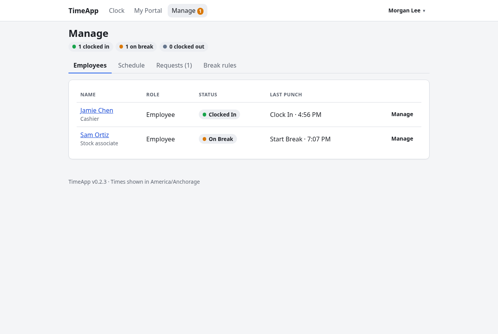
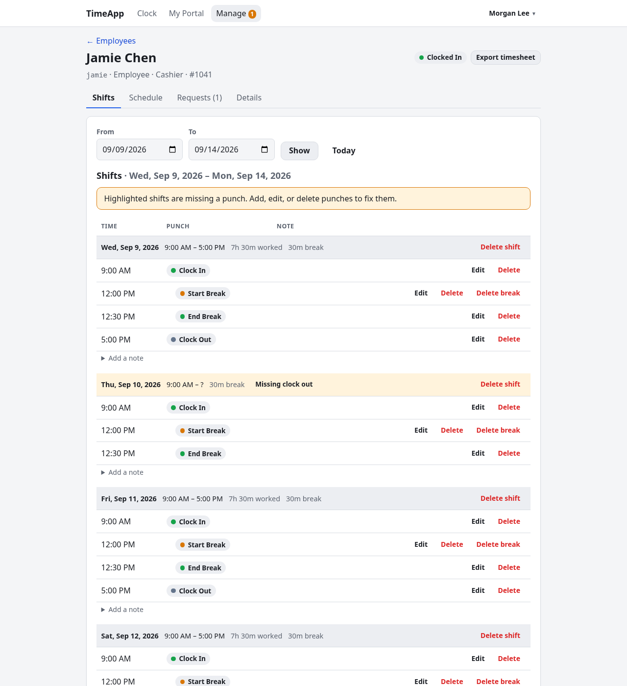
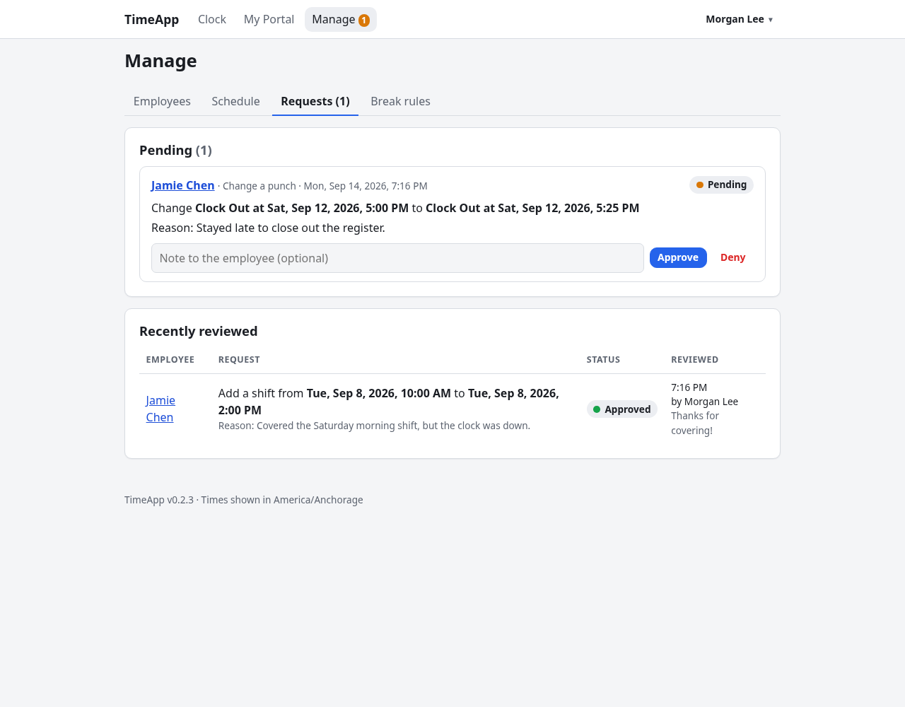

# Manager guide

**For:** managers, and admins, who can do all of this for everyone.
Your own clock, shifts, requests and profile work just like an employee's; see the [Employee guide](EMPLOYEE.md). Related: [Admin](ADMIN.md) · [Appearance](APPEARANCE.md)

- [Who you can manage](#who-you-can-manage)
- [The Manage page](#the-manage-page)
- [An employee's page](#an-employees-page)
- [Fix punches](#fix-punches)
- [Assign shifts](#assign-shifts)
- [Review edit requests](#review-edit-requests)
- [See the week's schedule](#see-the-weeks-schedule)
- [Set break rules](#set-break-rules)
- [Shift notes](#shift-notes)

---

## Who you can manage
- **Managers manage employee accounts.** Other managers and admins don't appear in your lists.
- **Teams:** if an admin has put you on a team, you only manage the employees on your team(s). If you're not on any team, you manage every employee. Only admins set up teams.
- **Your own punches and requests** only appear in **Manage** if an admin turns on "Managers can edit their own punches and approve their own requests".
- **Your own assigned shifts and break allowance** always need an admin.
- **Admins** can manage everyone, including managers and themselves.

---

## The Manage page

Click **Manage** in the top bar. When edit requests are waiting, the tabs show a count, e.g. **Requests (1)**.

The **Employees** tab shows how many people are clocked in, on break and clocked out, then everyone you manage:
- their **Name** and job title, and **Role**
- their **Status**, plus any shift scheduled for them today, e.g. "Scheduled 9:00 AM – 5:00 PM"
- **Hours this week**: what they've worked since the start of the week, including a shift in progress. Shifts with a missing punch aren't counted, and "2 not counted" says how many were left out
- their **Last punch**
- **Inactive** if their account has been deactivated

With teams set up, the list also has a **Team** column, and an employee's page shows their team next to their status.

**Several teams?** A **Team:** row above the tabs lets you pick which team you're looking at. Each team is shown on its own, and **Employees**, **Schedule**, **Requests** and **Break rules** all stick to the team you picked. (Admins also get **All teams** and **No team**.) The **Requests** count in the tabs covers all your teams.

Click a name, or **Manage**, to open that person's page. The other tabs are [Schedule](#see-the-weeks-schedule), [Requests](#review-edit-requests) and [Break rules](#set-break-rules).

---

## An employee's page
The top shows the person's username, role, job title, employee number and current status, with an **Export timesheet** button. It makes the same timesheet employees get; see [Export a timesheet](EMPLOYEE.md#export-a-timesheet). It has four tabs:

| Tab | What's there |
|---|---|
| **Shifts** | Their punches, grouped into shifts, with notes. Add, edit and delete punches. |
| **Schedule** | Their assigned shifts from the last 2 weeks through the next 4. Assign and remove shifts. |
| **Requests** | Their pending edit requests to review, and past ones. |
| **Details** | Their profile (username, role, job title, employee number, email, phone, account created), their weekly availability, and their break allowance. |

---

## Fix punches

On the **Shifts** tab, pick **From** and **To** dates and click **Show**; **Today** jumps back to today. If any shift is missing a punch, a banner says so, and those shifts are highlighted. Missing punches keep a shift out of the person's totals.

- **Add a punch:** in **Add punch**, choose the **Type** (Clock In, Start Break, End Break or Clock Out), the **Date & time**, and an optional **Note** such as "Forgot to clock out". Then click **Add punch**.
- **Change a punch:** click **Edit** next to it, change the type, time or note, and click **Save changes**.
- **Delete:**
  - **Delete** removes one punch.
  - **Delete break** removes a break's start and end together.
  - **Delete shift**, in the shift's header, removes every punch in that shift.

  Each asks you to confirm, and **none of them can be undone**.

Good to know:
- **Nothing checks the order of your edits**, so it's possible to create a broken shift. The warning badges show if you have.
- **Every punch you add or change is marked "Adjusted by" you.** The person sees that on their shifts.
- **Pending requests:** if the person has a pending edit request for a punch, it shows **Request pending**.

---

## Assign shifts
The person's **Schedule** tab lists their assigned shifts from the last 2 weeks and the next 4, with **When**, **Hours**, **Attendance** and any **Note**. Click a row to select it.

Under **Modify schedule** the selected shift is shown as "Selected: Mon, Sep 21, 2026, 9:00 AM – 5:00 PM · 8h 00m", with three buttons:

**Add Single Shift**
1. Enter when it **Starts** and **Ends** (at most 24 hours), and an optional **Note** such as "Inventory day".
2. Click **Assign shift**.

**Add Weekly Shift** assigns the same hours on the days you pick, week after week:
1. Tick the **Days**, e.g. Mon, Wed and Fri.
2. Enter the **Starts** and **Ends** times. An end time earlier than the start means the shift runs past midnight.
3. Pick the date to take the **First week from**, and how many weeks to **Repeat for** (1–26).
4. Click **Assign shifts**. Each one becomes an ordinary assigned shift, so you can change or remove them one at a time. The page then says e.g. "6 shifts assigned."

**Modify Shift** (only with a shift selected) changes that shift's **Starts**, **Ends** and **Note**. Click **Save changes**, or **Remove shift** to take it off the schedule.

If something looks off, TimeApp asks you to **Check before assigning** instead of saving right away:
- **"Overlaps another assigned shift: …"**
- **"Unavailable on Mondays."**: they haven't marked that day as available.
- **"Outside availability on Monday (available 8:00 AM – 6:00 PM)."**

For a weekly shift, each date with a problem is listed (the first 10, then "…and 3 more"). If you still want it, tick **Assign anyway** and submit again. Availability is only checked if the person has set it.

You can't assign shifts to yourself: "Only an admin can assign your own shifts." Changing the schedule needs JavaScript in your browser.

**Attendance** is worked out automatically from the person's punches:

| Badge | Meaning |
|---|---|
| **Upcoming** | Hasn't started. |
| **In progress** | Happening now; **Not clocked in yet** if they haven't punched in. |
| **Late 12m** | They clocked in after the start, beyond the grace period. While the shift is running, it also means they still haven't clocked in. |
| **Left early 20m** | They clocked out before the end, beyond the grace period. |
| **Missed** | It ended with no clock-in during it. |
| **On time** | None of the above. |

The grace period is **Grace minutes** in **Admin → Settings**, 5 by default.

---

## Review edit requests

Employees ask for punch fixes through requests. Find them under **Manage → Requests**, which lists everyone's, or on a person's **Requests** tab.

Each pending request shows who sent it and when, what they're asking for (e.g. "Change Clock Out at … to Clock Out at …"), and their **Reason**.
1. Optionally type a **Note to the employee**. They see it on their Requests tab.
2. Click **Approve** or **Deny**.

**Approve** makes the change right away. Punches it adds or changes are marked as adjusted by you, with the request number and reason as their note:
- **Change a punch**: updates the punch.
- **Delete a punch**: removes it.
- **Add a missing punch**: adds it.
- **Add a missing shift**: adds a Clock In and a Clock Out.

**Deny** changes nothing.

Things you might see:
- **"That punch has been changed since this was requested…"** or **"…has been deleted…"**: someone edited it after the request was made. Check before approving.
- **"This request has already been handled."**: another manager or admin got there first.
- **"The punch in this request no longer exists…"**: deny it instead.

**Recently reviewed** lists past decisions, with who reviewed them and any note. What employees can request depends on the admin's **Mode** setting:
- **Disabled**: no requests.
- **Approval**: requests wait for you.
- **Honor system**: requests apply immediately, and appear here as **Auto-approved**.

---

## See the week's schedule
**Manage → Schedule** shows every assigned shift for the people you manage, one day at a time, starting with the "Week of …". Use **← Previous**, **This week** and **Next →** to move between weeks. Each shift shows the person, the time, who assigned it, any note, its attendance badges, and **Remove**. To assign a new shift, open the person from the **Employees** tab.

---

## Set break rules
**Manage → Break rules** has two parts.

**Default break rules** apply to everyone without their own allowance. Leave a field blank for no limit, then click **Save break rules**.
- **Breaks per shift** (0–20): once someone uses them up, their **Start Break** button disappears. 0 means no breaks.
- **Minutes per break** (1–480): longer breaks are flagged on the shift, not stopped.

**Custom allowances** lists people with their own limits. To give someone one:
1. Open their page and go to the **Details** tab.
2. Under **Break allowance**, fill in **Breaks per shift** and/or **Minutes per break**. Leave a field blank to use the default.
3. Click **Save allowance**.

You can't change your own allowance: "Only an admin can change your own break allowance."

---

## Shift notes
Every shift on a person's **Shifts** tab has a note thread. You, the employee, and anyone else who manages them can post: click **Add a note** (or **Notes (2)**), type, and click **Add note**. Notes can be up to 1,000 characters. You can **Delete** your own notes; admins can delete anyone's.
